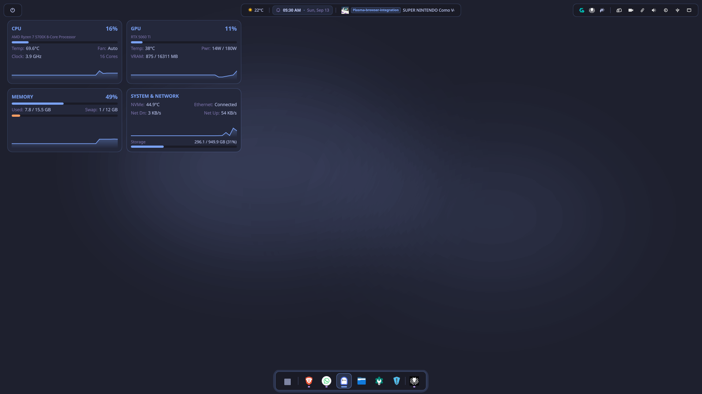
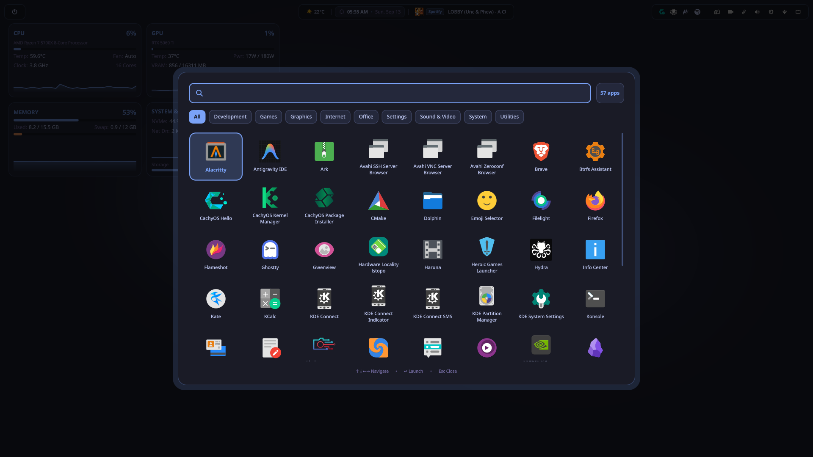

# Huginn

A [QuickShell](https://quickshell.outfoxxed.me/) desktop shell for **KDE Plasma 6 on Wayland**,
themed with the Tokyo Night palette.

Huginn is one of Odin's ravens: he flies across the world and comes back to
report what he saw. Which is roughly what a status bar does.

> Most QuickShell rices out there target Hyprland or Niri. This one runs **on
> top of KDE Plasma**, coexisting with KWin instead of replacing it.



## Screenshots

The application launcher, with search, category filters and a built-in calculator:



The top bar — weather, clock, media player and system tray:


The dock, which stays hidden until the pointer reaches the bottom edge:


## What's included

- **Top bar** — weather, clock with calendar, media player, system tray,
  volume, brightness, network and Bluetooth.
- **Auto-hiding dock** — pinned apps and open windows, split by a separator,
  with window previews on click and drag-to-reorder.
- **Application launcher** with search and a built-in calculator.
- **On-screen display** for volume and brightness.
- **Desktop monitoring widget** — CPU, GPU, memory, disk and network, with
  graphs and real hardware readings (nothing hardcoded).
- **Theme engine** that propagates the palette to GTK, Konsole, Alacritty,
  btop, Starship, VS Code and others.

## Requirements

- KDE Plasma 6 on a **Wayland** session
- [QuickShell](https://quickshell.outfoxxed.me/) installed (`quickshell` on the AUR)
- PipeWire + WirePlumber
- Python 3 with `python-dbus` (required: without it the dock can't see open windows)

The installer handles the rest (`playerctl`, `brightnessctl`, `ddcutil`,
`wl-clipboard`, `papirus-icon-theme`, `fastfetch`, among others) through
`pacman`, `dnf` or `apt`, and tells you explicitly what is missing instead of
failing silently.

## Installation

```bash
git clone https://github.com/matheushagedorn/huginn-kde.git ~/Projects/huginn
cd ~/Projects/huginn
./install.sh
```

`~/.config/quickshell` becomes a symlink to the repository, so `git pull`
updates the configuration directly. Pre-existing configs are moved to
`.bak.<timestamp>` rather than overwritten.

The installer writes the keyboard shortcuts too, so there is nothing to type
into System Settings by hand:

| Key | Script |
|---|---|
| Meta | `huginn-launcher` |
| Volume Up / Down / Mute | `huginn-volume-up` / `-down` / `-mute` |
| unbound | `huginn-lock` |

The scripts go to `~/.local/bin`. **Log out and back in once after installing**:
KDE builds its keyboard shortcut table when the session starts, so bindings
written afterwards do nothing until the next login. There is no way around it,
and no other step is pending.

The installer also releases the same keys from Plasma's own audio shortcuts
first. Two components claiming one key and neither answers reliably, and
disabling the `audioshortcutsservice` kded module does not release them: it
removes what implements them, so the key stays claimed and simply stops working.
The bindings are listed under **System Settings → Keyboard → Shortcuts** if you
want to change one.

To keep the dock from fighting the KDE panel for space, remove the native panel
(right-click it → Remove Panel). Huginn is its own notification server, so
removing the panel does not cost you notifications: Plasma serves them from the
panel applet, and without a replacement no notification from any application
would arrive at all.

### Brightness on external monitors

Brightness for DDC/CI monitors is written straight to `/dev/i2c-N`. `ddcutil
setvcp` does the same job in about 300ms on this hardware, and only 4ms of that
is process startup: the rest is its conservative DDC/CI pacing. The direct write
lands in roughly 40ms, which is what makes the slider track the drag instead of
catching up after it.

On most systems logind already grants the seat user an ACL on `/dev/i2c-*`, so
nothing is needed. Check with `getfacl /dev/i2c-1`; if your user is not listed,
add yourself to the `i2c` group and log back in:

```bash
sudo usermod -aG i2c "$USER"
```

Without access, Huginn falls back to `ddcutil` on its own. It still works, just
with the delay.

## Customization

- **Monitor** — windows are pinned to a specific output (`DP-2` by default). If
  yours is named differently (`kscreen-doctor -o` lists them), adjust the
  `screen:` line in `quickshell/shell.qml` and in the launcher and lockscreen
  modules.
- **Theme** — the active theme lives in `~/.config/huginn_current_theme.txt`.
  Available palettes are defined in `quickshell/theme/Theme.qml` (Tokyo Night,
  Catppuccin, Gruvbox, Nord, Rosé Pine, Everforest, Solarized and more).
- **Pinned dock apps** — reorder by dragging, or edit
  `quickshell/services/TaskService.qml`.

## Known limitations

- **The lock screen can't be themed.** On recent Plasma versions the greeter
  only exposes wallpaper, clock and media controls (System Settings → Security
  & Privacy → Screen Locking). And Wayland's session lock protocol prevents any
  ordinary application from drawing over a locked screen, so shipping a custom
  lock screen here isn't possible.
- **Duplicate volume OSD.** Plasma's native OSD is triggered by the `kded`
  module `audioshortcutsservice`, which also handles the volume keys. The
  installer offers to disable it; the keys are then rebound to Huginn's own
  scripts.
- **The monitoring widget sits behind windows**, by design (`Bottom` layer, like
  Conky). It's only visible with a clear desktop.

## License

[MIT](LICENSE), covering the modifications and additions in this repository.
The upstream project was published without an explicit license — inherited
material remains under its original author's terms.

## Credits

Derived from [Isshi0417/quickshell-rice](https://github.com/Isshi0417/quickshell-rice),
with fixes and substantial changes: real hardware detection instead of
hardcoded values, explicit monitor assignment across every window, a working
dock context menu and drag-to-reorder, auto-hiding dock, indicators that only
appear when the hardware actually exists, and the removal of the `sudo`
escalation the original installer triggered in a loop.
